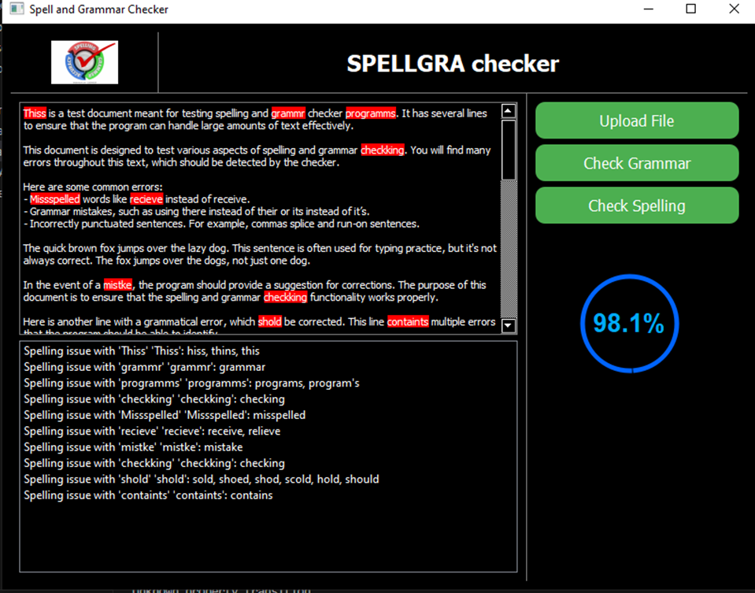

Spell and Grammar Checker
This is a desktop application built using PyQt5 that allows users to upload text files, detect spelling and grammar mistakes, and visualize the results with highlighted mistakes and a circular progress bar indicating the accuracy of the text.

Features
File Upload: Upload .txt and .docx files for processing.
Spelling and Grammar Checker: Automatically detects spelling and grammar issues using the SpellChecker library and language_tool_python.
Error Highlighting: Highlights spelling and grammar mistakes directly within the text editor.
Accuracy Bar: Displays a circular progress bar indicating the accuracy of the document.
Responsive UI: Dynamically resizes elements including images, text areas, and progress bars.

Installation
1. Set Up Virtual Environment
 -> on the project dir
 python -m venv venv 
 (this will create the python virtual environment for project)
 -> activate the virtual environment
 venv/Scripts/activate
 
 Install necessary packages
 pip install pyqt5 pyspellchecker language-tool-python python-docx

2. Install Java (Optional but Recommended)
The application uses language_tool_python for grammar checking, which requires Java to run the LanguageTool server locally. Download and install Java from the official Java website. Then create the environmental variable path for java.

Alternatively, you can use the LanguageTool public API if you do not want to install Java.

3. Running the Application
To start the application, run the main.py file:

Terminal
python main.py
Uploading Files
Use the Upload File button to select a .txt or .docx file for analysis.
Once uploaded, the text will appear in the editor.
Error Highlighting
Spelling mistakes will be highlighted in yellow with red text.
Grammar issues will also be highlighted similarly.
Accuracy Progress
A circular progress bar at the bottom of the window will indicate the accuracy percentage based on the number of detected errors.
Customizing UI
The layout splits the window vertically into 70% for the text editor and 30% for other UI components such as the accuracy bar.
You can adjust the UI appearance using setStyleSheet() for various widgets.

Example Screenshot

Troubleshooting
1. Unicode Errors when Uploading Files
If you encounter a UnicodeDecodeError when uploading .txt files, ensure that the file encoding is compatible with UTF-8. You can specify the encoding while reading the file.

python
Copy code
file.read(encoding="utf-8")

2. Java Not Installed Error
If you receive the error ModuleNotFoundError: No Java install detected, make sure Java is installed and properly set up in your system's PATH. Alternatively, switch to using the public LanguageTool API by updating the grammar checker logic.

python
Copy code
tool = language_tool_python.LanguageToolPublicAPI('en-US')